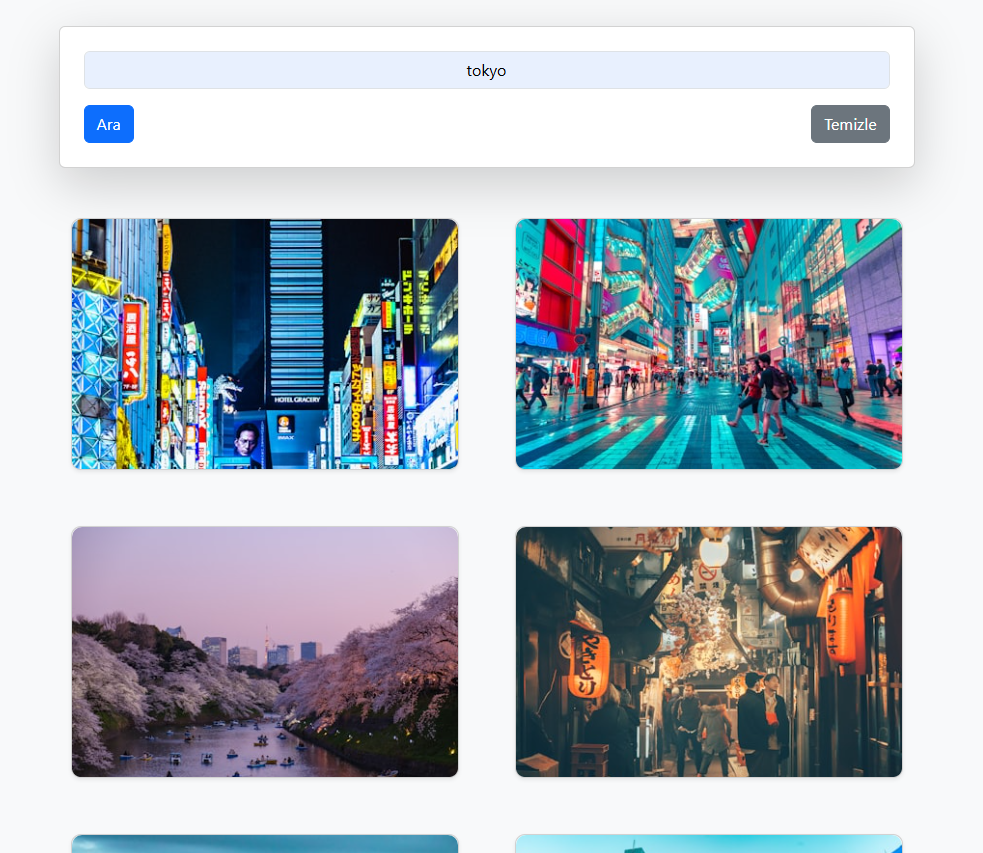

Resimex - Image Search App
Resimex, Unsplash API kullanılarak geliştirilmiş, kullanıcıların yüksek kaliteli resimleri arayıp keşfedebileceği modern bir web uygulamasıdır. HTML, CSS, JavaScript ve Bootstrap ile oluşturulmuştur ve responsive bir tasarıma sahiptir. Not: Bu proje, Unsplash API ile çalışır ve backend entegrasyonu gerektirmez; tüm işlemler frontend üzerinden gerçekleştirilir.
Özellikler

Resim Arama: Kullanıcılar anahtar kelimelerle Unsplash üzerinden resim arayabilir.
Responsive Tasarım: Bootstrap ile mobil ve masaüstü cihazlara uyumlu arayüz.
Resim Görüntüleme: Arama sonuçlarını galeri formatında görüntüleme.
Detay Görüntüleme: Resimlere tıklayarak detaylarını (örneğin, fotoğrafçı adı, indirme bağlantısı) görme.
Sayfalama: Çoklu arama sonuçlarını sayfalama ile keşfetme.

Kurulum
Gereksinimler

Modern bir web tarayıcısı (Chrome, Firefox, Safari vb.)
Yerel bir geliştirme ortamı (örneğin, VS Code veya herhangi bir metin editörü)
(Opsiyonel) Yerel bir sunucu (örneğin, Node.js ile http-server veya VS Code Live Server eklentisi)
Unsplash API Anahtarı: Unsplash API'ye erişmek için bir API anahtarı gereklidir. Unsplash Developers sayfasından ücretsiz bir API anahtarı edinin.

Adımlar

Depoyu Klonlayın:git clone https://github.com/kullanici/resimex.git

Proje Dizinine Gidin:cd resimex

API Anahtarını Ekleyin:
js/app.js dosyasını açın.
Dosyada belirtilen yere Unsplash API anahtarınızı ekleyin:const API_KEY = 'YOUR_UNSPLASH_API_KEY';

Dosyaları Açın:
Proje dosyalarını bir metin editöründe açın (örneğin, VS Code).
Yerel bir sunucu kullanarak uygulamayı başlatın. Örneğin:npx http-server

Alternatif olarak, index.html dosyasını doğrudan bir tarayıcıda açabilirsiniz (ancak API çağrıları için internet bağlantısı gereklidir).

Uygulamayı Tarayıcıda Görüntüleyin:
Tarayıcınızda http://localhost:8080 (veya kullanılan port) adresine gidin.

Kullanım

Resim Arama: Ana sayfadaki arama çubuğuna bir anahtar kelime (örneğin, "doğa", "şehir") girin ve aramayı başlatın.
Sonuçları Görüntüleme: Arama sonuçları galeri formatında listelenir.
Resim Detayları: Bir resme tıklayarak fotoğrafçı adı, resim açıklaması ve indirme bağlantısı gibi detayları görün.
Sayfalama: Daha fazla sonuç görmek için sayfalama kontrollerini kullanın.

Not: Unsplash API'nin ücretsiz sürümünde belirli bir istek sınırı vardır. API anahtarınızın kullanım limitlerini Unsplash Developer panelinden kontrol edebilirsiniz.

Ekran Görüntüleri

Unsplash API: Resim arama ve görüntüleme için kullanılır. API anahtarı gereklidir.

İletişim
Sorularınız veya önerileriniz için erayoktay02@gmail.com adresinden iletişime geçebilirsiniz.
